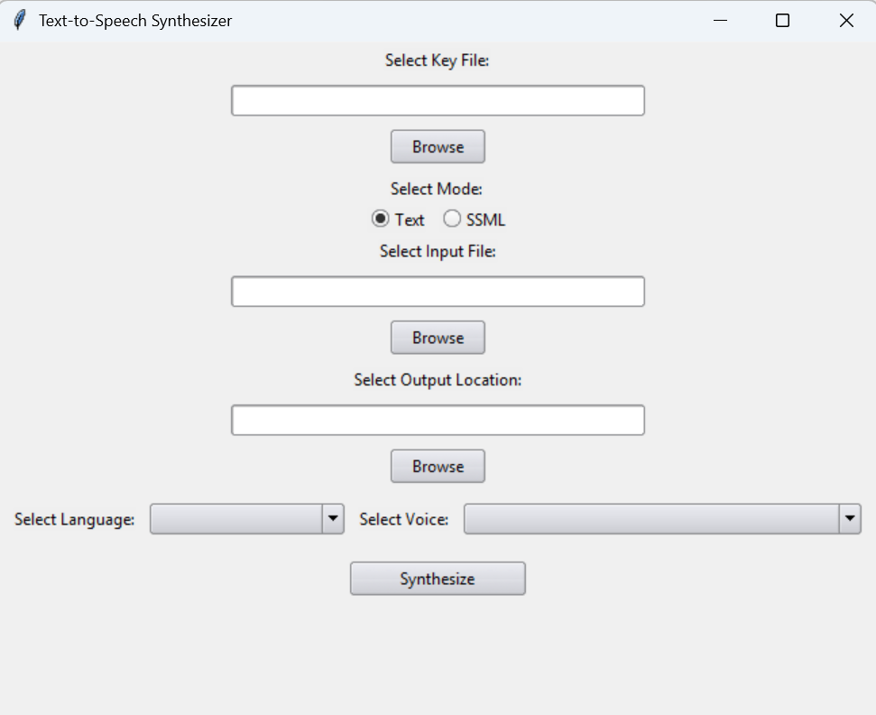
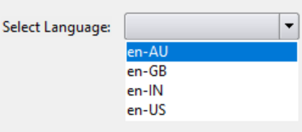
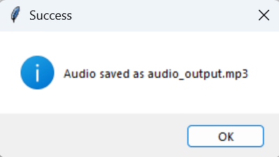

# Text-to-speech Synthesizer 

## Setting Up Connection to Google Cloud TTS Service

1. Sign in to [Google Cloud Console](https://console.cloud.google.com/).
2. On the [project selector page](https://console.cloud.google.com/projectselector2/home/dashboard), create a new project or select an existing project. 
3. Enable billing for the selected project. 
    * For new projects, this is automatically prompted on creation of new project. 
    * For existing projects, go to the [manage billing accounts page](https://console.cloud.google.com/billing) and click on **My projects** tab. Click on the three dots under the **Actions** column and select **Change billing**. 
4. In the resources search bar located at top of page, search for Text-to-Speech API and enable it. 
5. On the [create service account page](https://console.cloud.google.com/projectselector/iam-admin/serviceaccounts/create?walkthrough_id=iam--create-service-account#step_index=1), select an existing project.
6. Fill in the service account name and service account ID. Proceed by clicking **Done**. 
7. On the [service accounts page](https://console.cloud.google.com/iam-admin/serviceaccounts?walkthrough_id=iam--create-service-account-keys&start_index=1#step_index=1), click on the selected project.
8. Click on the email address of the service account previously created.
9. Click on the **keys** tab.
10. Click on **Add key** button and then select **Create new key**.
11. Select JSON as the key type and click **Create**. This downloads a service account key file which can be used to authenticate the service account. 

## Features

### Select Key File
Click the **Browse** button select a valid key file as obtained from [setting up the TTS service](#setting-up-connection-to-google-cloud-tts-service). 

### Select Mode
Click the **Text** or **SSML** button to select the desired mode. 

### Select Input File

Depending on the mode previously selected, click on the **Browse** button to select a suitable input file.

* For the Text mode, you will be prompted to select a `*.txt` file.
* For the SSML mode, you will be prompted to select a `*.ssml` file.

### Select Output Location

Click the **Browse** button to select a location to save the generated output audio file. 

### Select Language 

Click on the dropdown box to display the languages available for selection and select the desired language to be used for synthesis. 

### Select Voice

Similarly, click on the dropdown box to display the voices available for selection and select the desired voice to be used for synthesis. 

> [!NOTE]
> Some voices available in the Text mode are not supported in the SSML mode (e.g. Chirp HD voices)

### Synthesize

Lastly, click on the **Synthesize** button to generate the output audio file. A success message will be displayed when the audio file has been successfully synthesised. 

